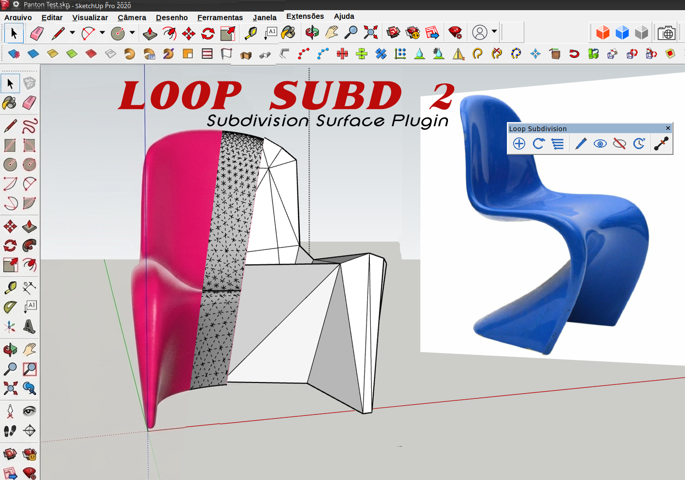

# LoopsubD 2

**Loop subdivision surface generation for SketchUp**

LoopsubD 2 is a substantial evolution of the original Loop Subdivision plugin created by **Nathan B (NB70)** and originally developed around 2009.

The project provides a non-destructive workflow for generating smooth subdivision surfaces from a Control Cage, with support for Crease edges, automatic updates, materials, textured meshes, polygon triangulation, and face-orientation correction.

## Features

- Non-destructive **Control Cage** workflow
- Loop subdivision levels **1–4**
- Separate generated **Subdivision Surface**
- Manual surface update
- Automatic surface update
- Editing of the original Control Cage
- **Crease** edges
- Crease propagation through subdivision
- Preservation of face materials
- Support for textured meshes
- Polygon triangulation for non-triangular faces
- Face-orientation correction on the generated surface
- Visualization of Crease edges
- Compatible with **SketchUp 2020 and later**

## How it works

LoopsubD 2 keeps the original modeling geometry as a **Control Cage** and generates the subdivided result as a separate surface.

The Control Cage can be edited without directly destroying the generated surface. The surface can then be rebuilt manually or automatically from the modified cage.

The following sequence illustrates the basic workflow, from the original model and Control Cage through subdivision, Crease operations, Control Cage editing, Auto Update, and the final surface:

Basic workflow:

1. Select a mesh or group of faces.
2. Create the LoopsubD 2 subdivision surface.
3. Choose the desired subdivision level.
4. Edit the Control Cage when necessary.
5. Update the surface manually or enable Auto Update.
6. Use Crease edges when sharper features are required.

## Control Cage

The Control Cage is the original geometry used as the source for subdivision.

LoopsubD 2 stores the Control Cage separately from the generated Subdivision Surface. The cage can be hidden, shown, and edited independently.

This non-destructive approach makes it possible to return to the original topology and modify the model without having to work directly on the dense subdivided mesh.

## Subdivision Levels

LoopsubD 2 supports subdivision levels from **1 to 4**.

Higher levels produce increasingly dense meshes. The appropriate level depends on the complexity of the model and the desired balance between surface smoothness and polygon count.

## Crease Edges

Crease edges allow selected edges of the Control Cage to retain sharper features during subdivision.

LoopsubD 2 includes commands to:

- Add Crease
- Remove Crease
- Clear Creases

Crease information is preserved through repeated subdivision levels, and the crease state is also considered by Auto Update.

## Auto Update

When Auto Update is enabled, LoopsubD 2 monitors changes to the Control Cage and rebuilds the generated surface when changes are detected.

This includes changes to the geometry and Crease state.

The system avoids rebuilding while the Control Cage is actively being edited and updates the generated surface after the editing operation has finished.

## Materials and Face Orientation

LoopsubD 2 includes handling intended to preserve the orientation of generated faces and maintain correct front/back material assignment.

The generated surface also preserves face materials from the source geometry where applicable.

## Polygon Triangulation

Subdivision processing works from triangular topology. LoopsubD 2 therefore includes polygon triangulation for non-triangular faces.

This is particularly useful when internal edges are removed and several triangles form a polygonal face.

## Installation

LoopsubD 2 is distributed as a SketchUp extension package (`.rbz`).

In SketchUp:

1. Open **Extension Manager**.
2. Choose **Install Extension**.
3. Select the LoopsubD 2 `.rbz` file.
4. Restart SketchUp if necessary.
5. Enable the Loop Subdivision toolbar.

The project is intended to support **SketchUp 2020 and later**.

## Toolbar

LoopsubD 2 provides a toolbar containing the main commands for creating and managing subdivision surfaces, including:

- Create subdivision surface
- Update surface
- Change subdivision level
- Edit Control Cage
- Show/Hide Control Cage
- Auto Update
- Add Crease

## Known Considerations

As with subdivision modeling in general, topology has a significant influence on the resulting surface.

Very complex, non-manifold, or unusual meshes may produce unexpected results. Testing with the intended modeling workflow is recommended, particularly when using geometry generated by other SketchUp extensions.

## Origin and Attribution

LoopsubD 2 is based on the original Loop Subdivision plugin created by **Nathan B (NB70)**.

The original plugin was developed around 2009 and distributed through Guitar-List. The original source identifies Nathan B as its author and refers to the Loop subdivision algorithm of Charles Loop.

The original 2009 source available to us does **not** contain a formal license declaration. A subsequent version of the source committed to the NB70 GitHub repository in 2012 contains the comment `# Apache 2.0 license`. The available repository history does not establish when or under what circumstances that notice was introduced.

LoopsubD 2 should therefore be understood as a substantial evolution of the original project, while the historical licensing information is documented here as accurately as the available source history permits.

## Credits

**Original author**  
Nathan B (NB70)

**LoopsubD 2 development**  
Marcos Netto

**Development assistance**  
OpenAI ChatGPT

See [CREDITS.md](CREDITS_v2.md) for additional references and attribution details.

## Changelog

See [CHANGELOG.md](CHANGELOG_v2.md) for the development history of LoopsubD 2.

## Technical References

- Charles Loop — Loop subdivision surface algorithm.
- Hoppe et al. — *Piecewise Smooth Surface Reconstruction*.
- Original Loop Subdivision plugin by NB70 / Nathan B.

## Status

**Current stable version: 2.10.1**

LoopsubD 2 has been extensively tested with SketchUp 2020, including simple and complex meshes, textured geometry, multiple subdivision levels, Crease operations, polygonal topology, and automatic updates.

The project is provided as an evolution of the original open-source Loop Subdivision plugin and is intended for practical use in SketchUp modeling workflows.
